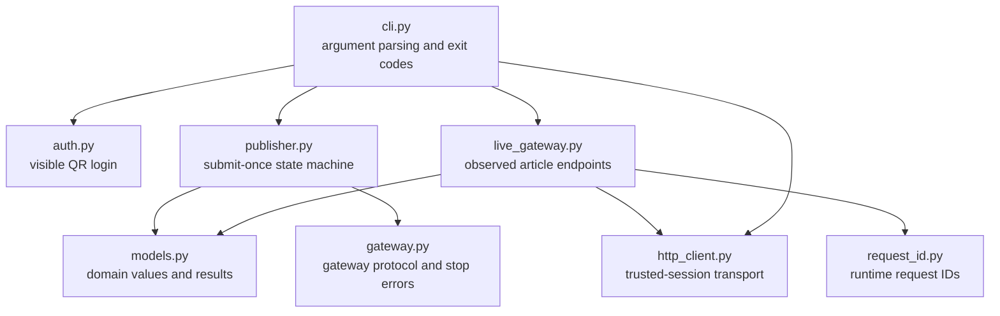
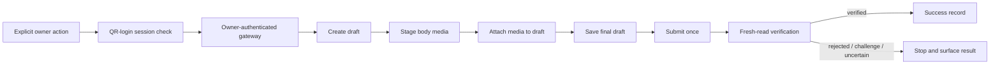

# Architecture

## Module map

The package keeps the user-facing command, workflow policy, transport, and observed platform adapter separate:

Responsibilities are intentionally narrow:

| Module | Responsibility | Must not do |
| --- | --- | --- |
| `cli.py` | Parse one explicit command, validate local files, map outcomes to exit codes | Store credentials or retry a write |
| `auth.py` | Open the normal visible QR-login page and return an in-memory owner session | Export cookies, persist a browser profile, or bypass challenges |
| `publisher.py` | Orchestrate draft, media, final save, one submit, and verification | Know endpoint URLs or invent retry policy |
| `gateway.py` | Define the adapter protocol and transport stop conditions | Contain platform-specific request fields |
| `live_gateway.py` | Translate the observed article editor workflow into gateway operations | Accept untrusted verification URLs or hide response drift |
| `http_client.py` | Enforce trusted HTTPS hosts and attach the current session per request | Send credentials to arbitrary URLs |
| `models.py` | Hold article blocks, normalized responses, and publish results | Perform network I/O |
| `request_id.py` | Generate request identifiers at runtime | Embed account, draft, or captured identifiers |

The dependency direction matters: `publisher.py` depends on the gateway protocol, so the state machine can be tested with local stubs without a browser or a live account. `live_gateway.py` is the only module that knows the observed endpoint shapes. `http_client.py` is the credential-carrying boundary and rejects anything outside its small HTTPS allowlist.

## The write path

## Reliability contract

| Stage | Required outcome | Failure behavior |
| --- | --- | --- |
| Session check | The embedding app provides a current owner session | Stop before any write. |
| Draft and media stages | Every response is structurally accepted | Stop; do not reach final submit. |
| Final submit | Exactly one outbound submit attempt | A timeout becomes `uncertain`, never an automatic retry. |
| Fresh read | `verify_article` confirms the submitted article | Mark success only after the match. |
| Challenge or drift | Identity challenge, response-shape drift, or explicit rejection | Stop and keep the diagnostic evidence local. |

## What makes article publishing different

The important engineering problem is not a single HTTP call. A complete article has mutable state across a draft, media, cover, serialized content, final submission, and public result. Treating the entire operation as one retryable request risks duplicate or partially published content.

The prototype therefore treats final submission as an irreversible boundary and verification as a separate phase.

This public CLI does not implement a browser fallback. An embedding application may add one only when its adapter can prove that no write was dispatched; after the final submit boundary, every uncertain result must remain a stop condition.
